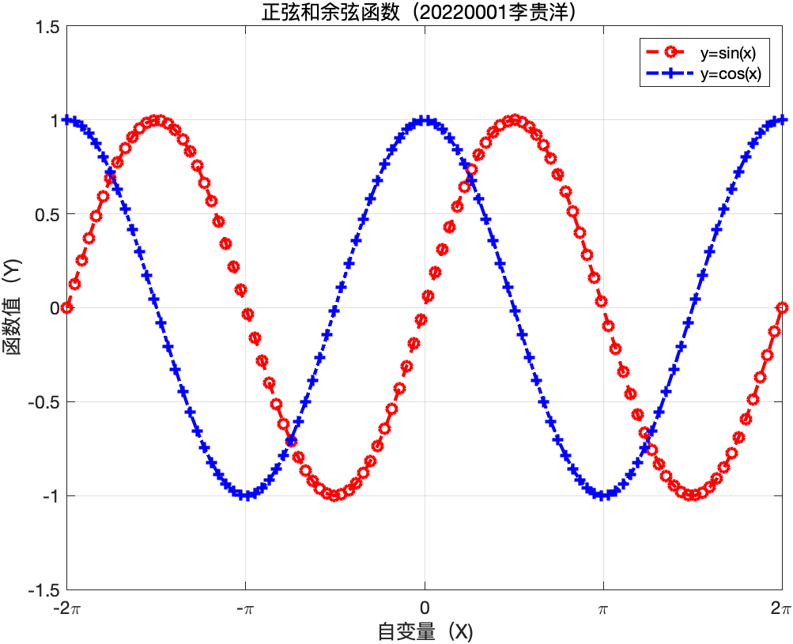
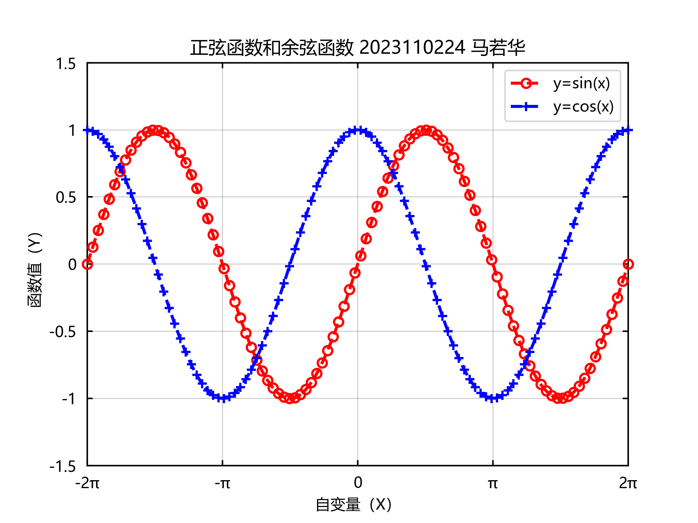
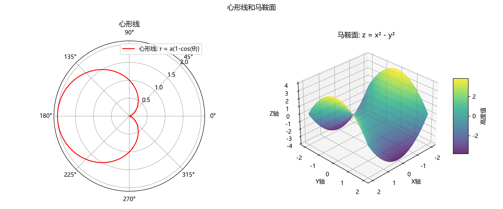
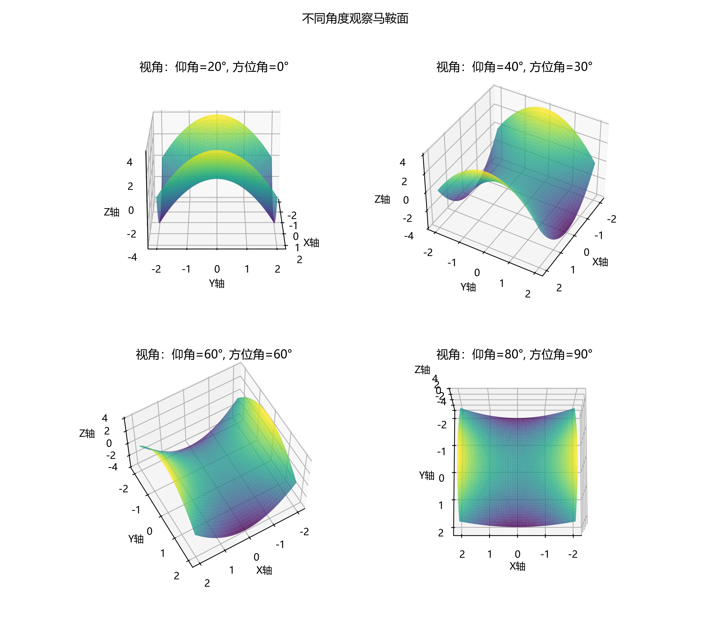
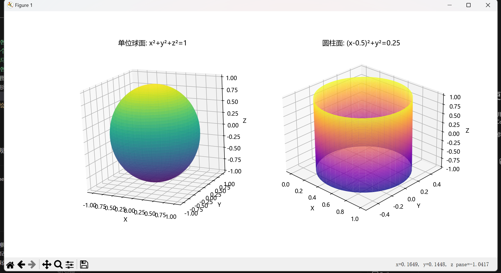
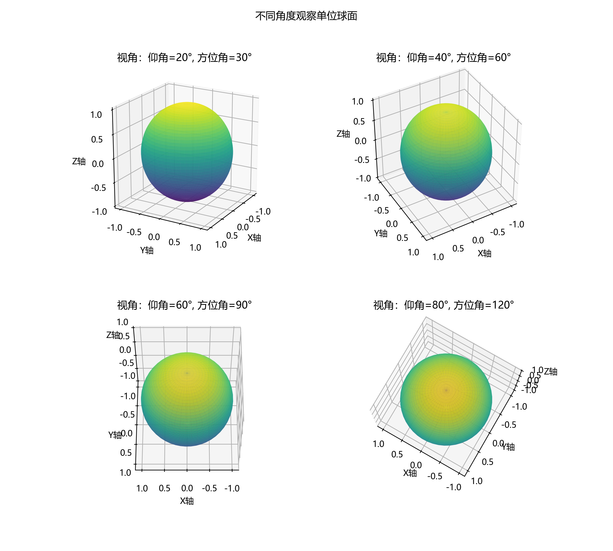
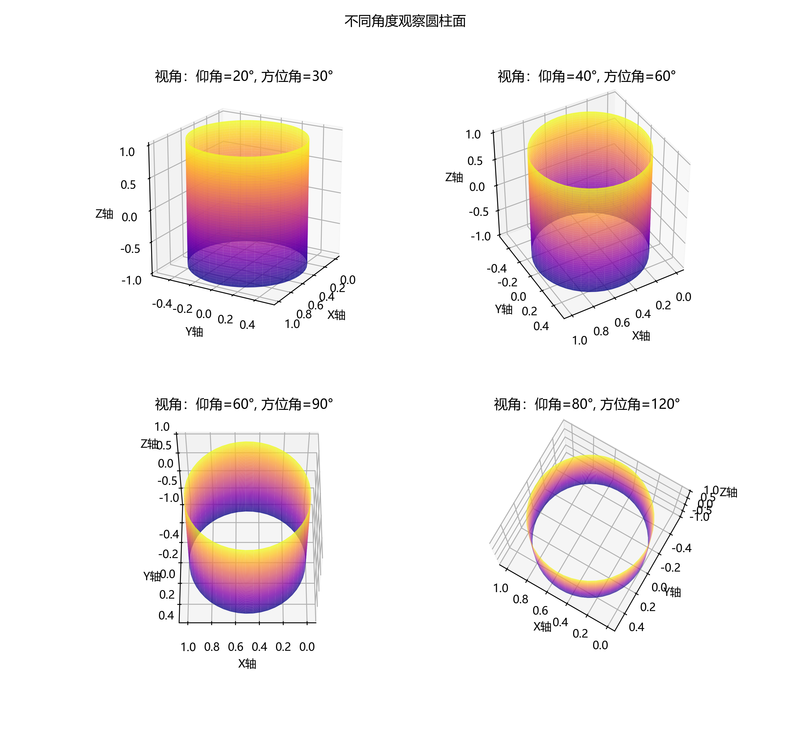

# 实验二 图形绘制

## 一、实验目的及要求

1. 了解Matlab和Python中二维图形的绘制。
2. 了解Matlab和Python中三维图形的绘制。

## 二、实验内容

1. 画出$\sin x$和$\cos x$在$-2 \pi$到$2 \pi$的函数图像，所有图像绘制在一张图（Axes）上。并显示。图像细节与例图一致，文字说明见图后。
    
    - Plot Area的X轴范围为$\left [ -2\pi, 2\pi\right ]$，Y轴范围为$\left [ -1.5, 1.5 \right ]$。使用固定的等比例坐标轴。
    - Plot Area有实线外边框。
    - 网格（Grid）采用灰色细实线。
    - 不专门突出绘制$x$、$y$坐标轴。
    - 刻度标签（tick marks）向内，且图形的四周都有。
    - X轴标签为`自变量（X）`，Y轴标签为`函数值（Y）`。
    - 用以下两种方式绘制$y=\sin x$和$y=\cos x$，要求sin使用红色，cos使用蓝色。先绘制两种方式的$\sin x$，再绘制$\cos x$。即图像重合处$\cos x$会覆盖$\sin x$。
        1. 绘制平滑的虚线构成的两函数图像。
        2. 用取点的方式绘制两函数图像，要求如下：
            - 每个周期（$2\pi$）取50个点。
            - sin 使用空心圆圈，cos 使用 `+`。
            - 处于边界（Spine）处（$\pm 2\pi$）的点超出边界线，不被边界（Spine）限制。
    - 在绘图区域（Plot Area）**内部**的右上角标出图例（Legend），标签分别为$y=\sin(x)$，$y=\cos(x)$。图例中只有两个项目，以$y=\sin(x)$为例，两种图线用同一个。整个图例有实现边框。
    - 标题位于绘图区外，格式为`正弦和余弦函数（2023010101 张三）`，其中括号内是学号和姓名。
    
2. 在同一平面中的两个窗口分别画出心形线和马鞍面。要求
    - 在图形上加格栅、图例和标注
    - 定制坐标；
    - 以不同角度观察马鞍面。
  
3. 以不同的视角观察球面$x^2 + y^2 + z^2 = r^2$和圆柱面$x^2+y^2=rx$所围区域。

## 三、实验主要流程、基本操作或核心代码、算法片段

### 1. 正弦余弦函数图像绘制

首先完成了正弦和余弦函数的绘制，关键步骤包括：

1. 通过 `chinese_fix()` 函数解决中文显示问题
2. 设置图形属性（坐标轴范围、标题、刻度等）
3. 分别绘制函数的连续图形和离散点图形

以下是关键代码段：

```python
# 生成绘图用的值序列
dense_seq = np.linspace(-2 * np.pi, 2 * np.pi, 1000)  # 密集点用于平滑曲线
sparse_seq = np.linspace(-2 * np.pi, 2 * np.pi, 100)  # 稀疏点用于标记

# 绘制红色的正弦函数
sin_line = plt.plot(dense_seq, np.sin(dense_seq), "r--", linewidth=2, zorder=5)[0]
sin_scatter = plt.plot(
    sparse_seq,
    np.sin(sparse_seq),
    "o",
    markersize=6,
    markeredgecolor="red",
    markerfacecolor="none",  # 空心圆点
    markeredgewidth=1.5,     # 线宽
    clip_on=False,           # 不受边界限制
    zorder=5,
)[0]
```



### 2. 心形线和马鞍面的绘制

心形线采用极坐标系统，马鞍面采用三维坐标系统，关键步骤：

1. 创建包含两个子图的图形界面
2. 在左侧子图中绘制极坐标下的心形线 `r = a(1-cos(θ))`
3. 在右侧子图中绘制三维马鞍面 `z = x² - y²`

心形线的极坐标方程实现：
```python
a = 1  # 心形线参数
theta = np.linspace(0, 2 * np.pi, 1000)
r = a * (1 - np.cos(theta))  # 心形线方程
```

马鞍面的参数方程实现：
```python
x = np.linspace(-2, 2, 50)
y = np.linspace(-2, 2, 50)
X, Y = np.meshgrid(x, y)
Z = X**2 - Y**2  # 马鞍面方程
```

在交互式窗口中可以拖动观察马鞍面的各个方向：



对马鞍面从不同角度进行观察：



### 3. 球面和圆柱面的绘制与观察

球面和圆柱面的绘制采用参数方程表示，并实现了交互式观察和静态多角度观察：

球面的参数方程实现：
```python
u = np.linspace(0, np.pi, 50)
v = np.linspace(0, 2 * np.pi, 50)
U, V = np.meshgrid(u, v)
X = np.sin(U) * np.cos(V)
Y = np.sin(U) * np.sin(V)
Z = np.cos(U)
```

圆柱面的参数方程实现：
```python
theta = np.linspace(0, 2 * np.pi, 50)
z = np.linspace(-1, 1, 50)
Theta, Zc = np.meshgrid(theta, z)
Xc = 0.5 + 0.5 * np.cos(Theta)  # (x-0.5)²+y²=0.25
Yc = 0.5 * np.sin(Theta)
```

交互式观察效果：



从不同角度观察球面：



从不同角度观察圆柱面：



## 四、实验结果的分析与评价

### 1. 正弦余弦函数图形绘制

成功实现了按要求绘制正弦和余弦函数图像。图像中包含了两种表示方式（连续虚线和离散点标记），并且完整实现了各种细节要求：

- 坐标轴范围设置准确，坐标轴标签和刻度正确显示
- 网格线使用灰色细实线，视觉效果良好
- 边界处的点正确地超出了边界线
- 图例位置正确，位于绘图区右上角，且包含两种线型

绘图技巧方面，使用了zorder参数控制绘图元素的前后顺序，确保网格线在下方，函数图像在上方，而且余弦函数覆盖正弦函数。HandlerTuple的使用使得图例可以同时显示线型和点标记。

### 2. 心形线和马鞍面绘制

心形线的绘制采用极坐标系统，成功实现了完整的心形曲线。通过自定义r轴刻度和标签位置，使得图形更加美观。

马鞍面绘制采用三维曲面，并应用了颜色映射增强视觉效果。通过调整视角参数(elev, azim)，成功从不同角度观察了马鞍面的形状特征，这有助于理解其三维结构。颜色条的添加使得高度值更加直观。

### 3. 球面和圆柱面的绘制与观察

成功实现了球面方程x²+y²+z²=1和圆柱面方程x²+y²=x的三维可视化。通过参数方程的方式构建了这两个三维曲面，并采用了不同的颜色映射以区分。

交互式窗口的实现增强了用户体验，允许用户自由旋转和缩放图形，有助于全方位理解三维结构。同时，通过预设的四种视角生成的静态图像，展示了球面和圆柱面在不同角度下的形态特征。

### 总体评价

本次实验全面掌握了Python中Matplotlib库的二维和三维绘图功能，成功完成了所有要求的图形绘制任务。主要收获包括：

1. 熟练掌握了各种图形元素的精确控制（线型、颜色、标记、网格等）
2. 学会了在同一图中混合多种绘图元素
3. 掌握了极坐标系统和三维坐标系统的使用
4. 掌握了使用参数方程构建复杂曲面的方法
5. 实现了交互式和静态多角度观察三维图形

## 5. 验证身份的字符串

```plaintext
马若华 2023110224 数学建模与数学实验作业 指导教师李贵洋副教授"
```