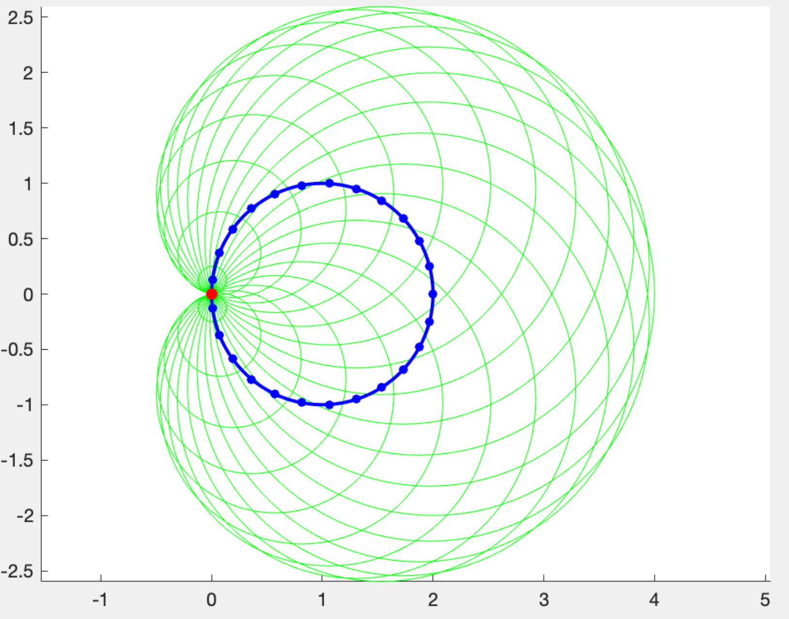

# 实验三 图像处理和符号运算

## 实验目的及要求

1. 了解装载和保持图像的方法，掌握图像的矩阵表示 ；
2. 掌握采用操作矩阵的方法操作图像的方法。
3. 掌握符号运算的方法。

## 实验内容

1. 图像处理1
    
    - 将给定图像旋转90度。
    - 把给定图像复制八份，按2×4布局拼接成一张图。
    - 从heart.png图中提取蓝色环。
2. 图像处理2
    - 挑选一个图像，对其提取边缘特征。
    - 挑选一个图像，对其进行锐化和模糊化处理。
3. 符号运算
    - 求$\lim_{x \to 1}\frac{x^{2}-1}{x - 1}$的值。
    - 求$y = x^{2}-5\sin x+\ln x$的导数。
    - 求$\displaystyle\int 3x+ \sin x$。
    - 求$\displaystyle\int\limits_{0}^{3}x\sin x$。
    - 求$(x + y)^{5}$的展开式。